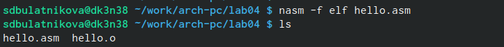
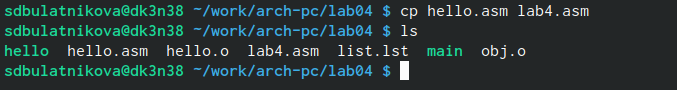

## Титульный лист
*РОССИЙСКИЙ УНИВЕРСИТЕТ ДРУЖБЫ НАРОДОВ*

**Факультет физико-математических и естественных наук**

**Кафедра прикладной информатики и теории вероятностей**

**ОТЧЕТ** 

**ПО ЛАБОРАТОРНОЙ РАБОТЕ № 4**

*дисциплина: Архитектура компьютеров и операционных систем*	

Студент: Булатникова София Дмитриевна 
Студенческий билет: 1132239104
Группа:  НБИ-03-23

**МОСКВА**

2023 г

# Цель работы

Освоение процедуры компиляции и сборки программ, написанных на ассемблере NASM.

# Выполнение работы

**Программа Hello world!**

Создала каталог 

Создала текстовый файл с именем hello.asm

Ввела в него текст. 

**Транслятор NASM**

Компилирую приведенный текст

**Расширенный синтаксис командной строки NASM**

Выполнила следующую команду:

nasm -o obj.o -f elf -g -l list.lst hello.asm

**Компоновщик LD**

Выполните следующую команду:
ld -m elf_i386 hello.o -o hello

Выполнила следующую команду:
ld -m elf_i386 obj.o -o main 
Запустила на выполнение созданный исполняемый файл, находящийся в текущем каталоге,

**Самостоятельная работа**

В каталоге создала копию файла

 
С помощью текстового редактора внесла изменения в текст программы в
файле lab4.asm так, чтобы вместо Hello world! на экран выводилась строка с моей
фамилией и именем.

 
Оттранслировала полученный текст программы lab4.asm в объектный файл. Выполнила
компоновку объектного файла и запустила получившийся исполняемый файл.

*4*
Скопировала файлы hello.asm и lab4.asm в локальный репозиторий в каталог 
Загрузила файлы на Github.

# Выводы

Освоила процедуры компиляции и сборки программ, написанных на ассемблере NASM.
